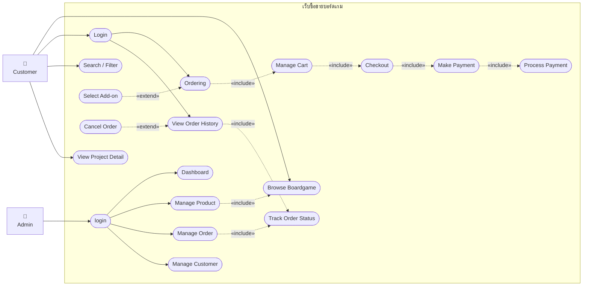
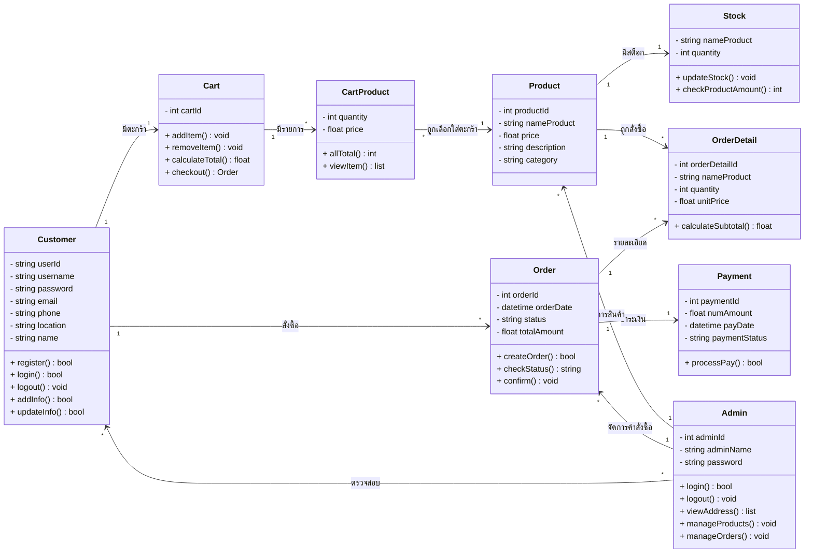
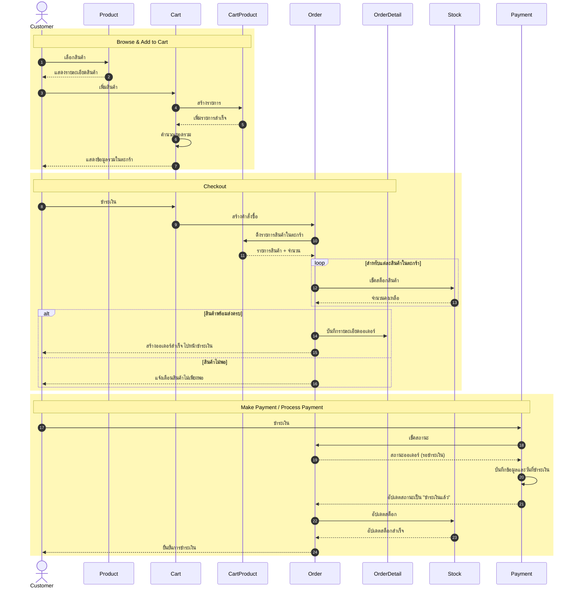
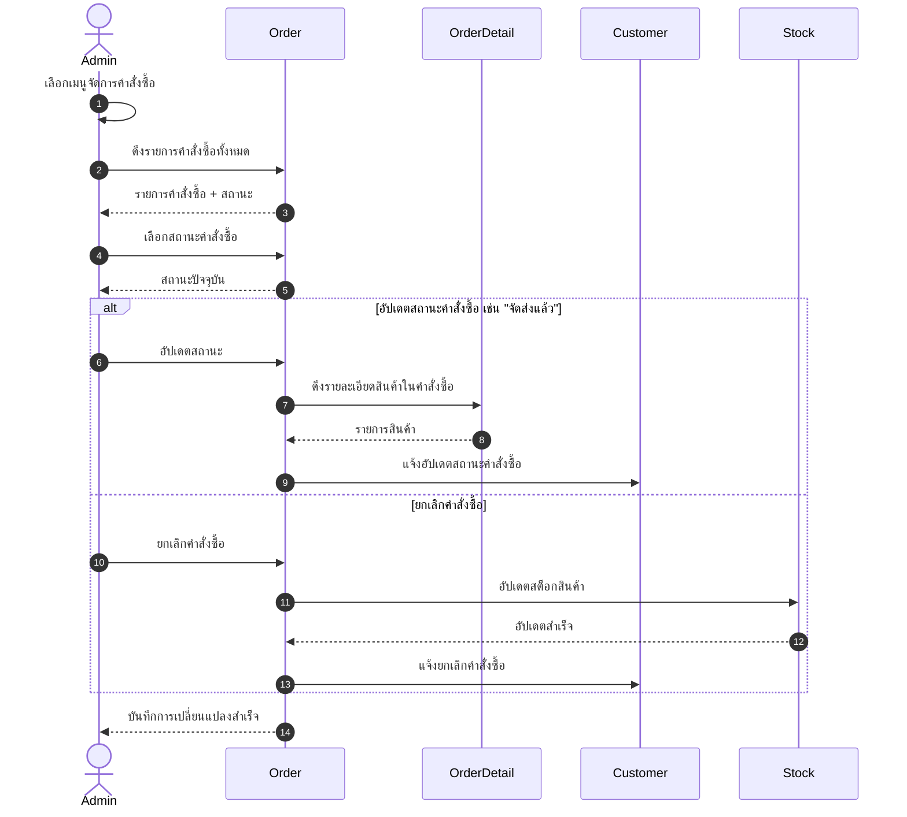
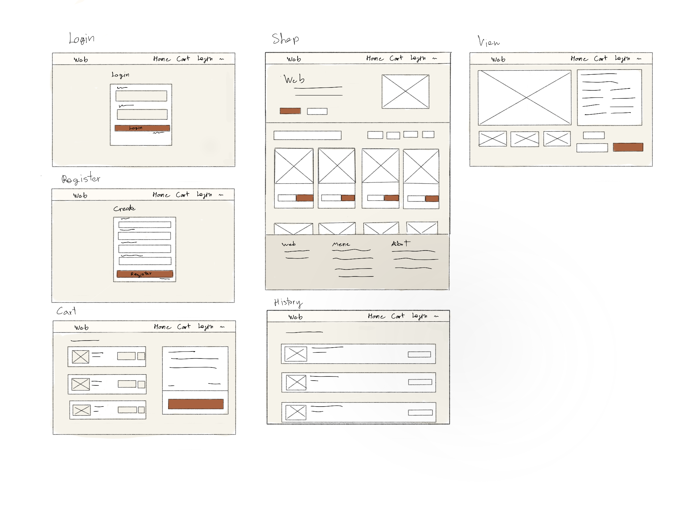
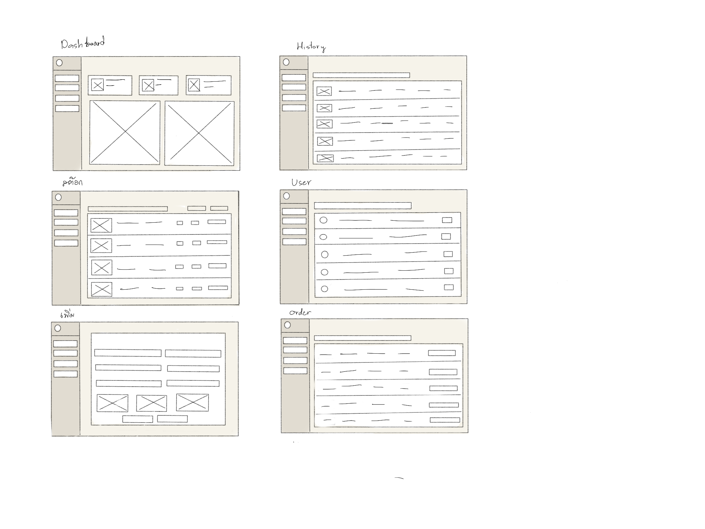

<h1 align="center">🎲 CSI204-Project</h1>

<h2 align="center">House Board</h2>

 <b>Boardgame Ecommerce Platform</b> 

 เว็บไซต์ eCommerce สำหรับร้านจำหน่ายบอร์ดเกมบนเว็บไซต์ ผู้ใช้สามารถเลือกดูสินค้า

https://house-board-swart.vercel.app/
Admin: admin@boardhouse.test / admin123
Customer: jane@example.com / password

รายชิ่อสมาชิกกลุ่ม

| ลำดับ | ชื่อ-นามสกุล            | กลุ่ม | รหัสนักศึกษา | ตำแหน่ง |
| ----- | ----------------------- | ----- | ------------ | ----- |
| 1     | ภูริวัชร์ จินดาพงษ์ศิริ | T003  | 67182803     | Project Manager |
| 2     | ภานุกร แสงมณี           | T001  | 67161002     | Fullstack Dev |
| 3     | บุรพร วันทอง            | T001  | 67167437     | Fullstack Dev |
| 4     | กนก รัตนเรืองรักษ์      | T001  | 67188118     | Fullstack Dev |

## ภาพรวมโครงการ

### Project Overview

เว็บไซต์นี้เป็นแพลตฟอร์มอีคอมเมิร์ซสำหรับขายบอร์ดเกมโดยเฉพาะ มุ่งให้บริการกับนักเล่นบอร์ดเกมทั่วไปในประเทศไทย ด้วยแนวคิดหลักคือ

อย่างไรก็ตาม โครงการนี้ไม่ได้มีเป้าหมายเพียงแค่สร้างผลิตภัณฑ์เท่านั้น แต่ยังถูกออกแบบมาเพื่อเป็นโครงการฝึกทักษะการทำงานร่วมกันเป็นทีม โดยจำลองสภาพแวดล้อมการพัฒนาซอฟต์แวร์จริง ทีมงานจะได้ฝึกวางแผน แบ่งงาน สื่อสาร และแก้ปัญหาร่วมกันตลอดกระบวนการพัฒนา

---

## ที่มาและความสำคัญ

ในปัจจุบัน ธุรกิจการซื้อขายสินค้าออนไลน์ได้รับความนิยมเพิ่มมากขึ้น เนื่องจากผู้ใช้งานสามารถเลือกดูสินค้า เปรียบเทียบราคา และสั่งซื้อสินค้าได้อย่างสะดวกผ่านเว็บไซต์ โดยไม่จำเป็นต้องเดินทางไปยังหน้าร้านจริง สินค้าประเภทบอร์ดเกมก็เป็นหนึ่งในสินค้าที่มีกลุ่มผู้สนใจเฉพาะทางมากขึ้น ทั้งในกลุ่มนักเรียน นักศึกษา กลุ่มเพื่อน ครอบครัว และผู้ที่ชื่นชอบกิจกรรมสันทนาการแบบเล่นร่วมกัน

อย่างไรก็ตาม การซื้อขายบอร์ดเกมผ่านช่องทางทั่วไปอาจยังมีข้อจำกัด เช่น การค้นหาข้อมูลสินค้าไม่สะดวก การตรวจสอบราคาและจำนวนสินค้าคงเหลือทำได้ยาก รวมถึงร้านค้าขนาดเล็กอาจยังไม่มีระบบสำหรับจัดการข้อมูลสินค้า คำสั่งซื้อ และสถานะการจัดส่งอย่างเป็นระบบ ด้วยเหตุนี้ กลุ่มผู้พัฒนาจึงมีแนวคิดในการจัดทำเว็บไซต์ BoardHouse ซึ่งเป็นระบบร้านขายบอร์ดเกมออนไลน์ เพื่อจำลองการทำงานของระบบ e-Commerce สำหรับการขายบอร์ดเกม

BoardHouse ถูกออกแบบให้ผู้ใช้งานสามารถเลือกดูรายการบอร์ดเกม ค้นหาสินค้า ดูรายละเอียดสินค้า เพิ่มสินค้าลงตะกร้า ทำรายการสั่งซื้อ และติดตามประวัติคำสั่งซื้อได้ ในขณะเดียวกัน ผู้ดูแลระบบสามารถจัดการข้อมูลสินค้า ตรวจสอบคำสั่งซื้อ และปรับสถานะคำสั่งซื้อได้ผ่านหน้า Admin ระบบนี้จึงช่วยให้การซื้อขายบอร์ดเกมมีความสะดวก เป็นระเบียบ และใกล้เคียงกับกระบวนการทำงานของเว็บไซต์ e-Commerce จริง

---

## เป้าหมายทางธุรกิจและขอบเขต

### วัตถุประสงค์

- เพื่อพัฒนาเว็บไซต์อีคอมเมิร์ซสำหรับจำหน่ายบอร์ดเกมที่ใช้งานได้
- เพื่อให้ผู้ใช้สามารถค้นหา เลือก และสั่งซื้อบอร์ดเกมได้อย่างสะดวก
- เพื่อให้ Admin สามารถจัดการสินค้า สต็อก และคำสั่งซื้อได้อย่างมีประสิทธิภาพ
- เพื่อนำเสนอข้อมูลสินค้าที่ครบถ้วน ช่วยให้ผู้ซื้อตัดสินใจได้ง่ายขึ้น

### ขอบเขตของระบบ

- ระบบแสดงสินค้า ค้นหา และกรองตามประเภท จำนวนผู้เล่น และระดับความยาก
- ระบบตะกร้าสินค้าและกระบวนการสั่งซื้อ
- ระบบสมาชิก สมัคร เข้าสู่ระบบ และดูประวัติการสั่งซื้อ
- ระบบจัดการสินค้าสำหรับ Admin เช่น เพิ่ม ลบ แก้ไขสินค้า และจัดการสต็อก
- การพัฒนาโดยใช้ Git ร่วมกันและมีกระบวนการ review งาน

---

## การวางแผน Planning

ในขั้นตอนการวางแผนทีมได้เลือกที่จะทำเว็บไซต์ **“House Board”** ซึ่งเป็นเว็บไซต์ eCommerce สำหรับจำหน่ายบอร์ดเกม มีวัตถุประสงค์เพื่อให้ลูกค้าสามารถเลือกค้นหาสินค้า ดูรายละเอียดบอร์ดเกม ค้นหาสินค้า และสั่งซื้อผ่านเว็บไซต์ได้อย่างง่ายดาย

ช่วงแรกของการทำงานทีมพัฒนาได้เลือกใช้ Notion สำหรับการวางแผนและแบ่งหน้าที่รวมถึงกำหนด Timeline เพื่อให้งานสามารถเป็นไปได้ตามกำหนดการ โดยมีเหตุผลการเลือกใช้ Notion เนื่องจาก Notion สามารถรองรับการใช้งานได้หลากหลายรูปแบบ มีขอบเขตการทำงานกว้าง มี Template ให้สามารถเลือกใช้ได้มากมาย สามารถเชิญบุคคลอื่นเข้ามาดูหรือแก้ไขได้อีกด้วย

การเลือกเครื่องมือพัฒนาทีมได้ใช้ Figma ในการออกแบบและทำ Wireframe เนื่องจาก Figma ใช้งานง่ายและมีแหล่งเรียนรู้จำนวนมาก ในส่วนของ Frontend ทีมเลือกใช้ React และบันทึกข้อมูลเป็น Local Storage โดยมี GitHub เป็นตัวกลางในการส่งข้อมูลของแต่ละคน

---

## การวิเคราะห์ Analysis

### User Persona

-

---

## Functional Requirement

House Board จะแบ่งผู้ใช้งานออกเป็นสองบทบาทด้วยกัน ได้แก่ Customer ผู้ซื้อ และ Admin ผู้จำหน่ายผ่านเว็บไซต์ โดยแต่ละบทบาทจะมี Function ดังนี้

### Customer

| รหัส | ฟังก์ชัน | รายละเอียด | ความสำคัญ |
| ---- | -------- | ----------- | ---------- |
|  C01 | Register / Login | สร้างบัญชี, เข้าสู่ระบบ | High |
|  C02 | แก้ไขข้อมูลส่วนตัว | แก้ไขชื่อ อีเมล รหัสผ่าน ที่อยู่ เบอร์โทร | High |
|  C03 | ดูรายละเอียดสินค้า | แสดงรายการบอร์ดเกม รูป ชื่อ ราคา ประเภท | High |
|  C04 | ค้นหาสินค้า | ค้นหาด้วยชื่อ ประเภท | High |
|  C05 | ฟิลเตอร์ประเภทสินค้า | กรองตามช่วงอายุ ประเภท ราคา ระยะเวลาที่ใช้ในการเล่น | Mediun |
|  C06 | ตะกร้าสินค้า | เพิ่ม/ลด สินค้าถ้าและแสดงยอดรวม | High |
|  C07 | การชำระเงิน | เลือกช่องทางการชำระเงิน | High |
|  C08 | ตรวจสอบที่อยู่ | เลือกที่อยู่หรือเพิ่มที่อยู่ใหม่ | High |
|  C09 | การติดตามออเดอร์ | ดูสถานะการสั่งซื้อ ชำระเงินแล้ว รอจัดส่ง กำลังจัดส่ง ส่งสำเร็จ | High |
|  C10 | ตรวจสอบประวัติการสั่งซื้อ | ดูออเดอร์ที่เคยสั่งซื้อ | Mediun |

---

### Admin

| รหัส | ฟังก์ชัน | รายละเอียด | ความสำคัญ |
| ---- | -------- | ----------- | ---------- |
| A01  | Login | เข้าสู่ระบบ | High |
| A02  | เพิ่ม Admin คนอื่นได้ | เพิ่ม admin คนอื่น | Low |
| A03  | ดูข้อมูล Customer | ดูข้อมูล customer | Mediun |
| A04  | จัดการผู้ใช้ | แก้ไขข้อมูล customer, admin | High |
| A05  | จัดการสินค้า CRUD | เพิ่ม ลบ แก้ไข ข้อมูลสินค้า | High |
| A06  | จัดการออเดอร์ | แก้ไขข้อมูลออเดอร์ | High |
| A07  | Dashboard | แสดงยอดการสั่งซื้อ รายได้ จำนวนลูกค้า | Mediun |

---

### System

| รหัส | ฟังก์ชัน | รายละเอียด | ความสำคัญ |
| ---- | -------- | ----------- | ---------- |
| S01  | ลดสินค้า stock | จำนวนของใน Stock ลดตามที่ customer สั่งซื้อ | High |
| S02  | ตรวจสอบ out of stock | ถ้าของใน Stock หมดจะสั้งซื้อไม่ได้ | High |
| S03  | stage ของการสั่งสินค้า | ชำระเงินแล้ว เตรียมจัดส่ง ระหว่างจัดส่ง | High |

---

## Non-Functional Requirements

| หัวข้อ | รายละเอียด |
| ------ | ----------- |
|  | |

---

## Diagram

### Use Case Diagram

### Class Diagram

### Sequence Diagram

#### Customer Checkout Sequence

#### Admin Order Management Sequence

---

## Design ออกแบบ

## System Structure

House Board เป็นเว็บจำหน่ายบอร์ดเกมแบบ eCommerce แต่อย่างไรก็ตามเนื่องจากโปรเจกต์นี้เป็นการบันทึกข้อมูลแบบ Local Storage ดังนั้นโครงสร้างของระบบจะแบ่งออกเป็น 3 ส่วนหลัก ได้แก่ Frontend, Backend และ Local Storage

### Frontend

Frontend จะเป็นส่วนที่ผู้ใช้งานมองเห็นและใช้งานผ่านเว็บไซต์ เช่น หน้าแรก หน้าเข้าสู่ระบบ หน้าแสดงสินค้า การแก้ไขสินค้า ตะกร้า และการ Checkout มีหน้าที่แสดงข้อมูลสินค้า รับข้อมูลจากผู้ใช้งาน และแสดงรูปภาพสินค้าที่ถูกจัดเก็บไว้ในเครื่องคอมพิวเตอร์ผ่าน Backend

### Backend

Backend ของระบบใช้สำหรับให้บริการไฟล์รูปภาพสินค้า โดยใช้เครื่องคอมพิวเตอร์ของทีมเป็นตัวจัดเก็บรูปภาพ และใช้ Backend เป็นตัวกลางในการส่งรูปภาพไปแสดงบนหน้าเว็บไซต์

Backend ที่ใช้ในโปรเจกต์นี้จะพัฒนาโดยใช้ Node.js และ Express.js เพื่อสร้าง Local File Server สำหรับให้ Frontend เรียกใช้งานรูปภาพสินค้า

### Local Storage

Local Storage ใช้สำหรับจัดเก็บข้อมูลภายใน Browser ของผู้ใช้งาน เช่น ข้อมูลสินค้า ข้อมูลผู้ใช้งาน ข้อมูลตะกร้าสินค้า และข้อมูลคำสั่งซื้อ

อย่างไรก็ตาม Local Storage ไม่ใช่ Database จริง เนื่องจากข้อมูลถูกจัดเก็บไว้ที่เครื่องของผู้ใช้งานแต่ละคน ไม่ได้ถูกจัดเก็บไว้บน Server กลาง

## Tech Stack

โครงการ **BoardHouse** เป็นเว็บแอปพลิเคชันสำหรับขายบอร์ดเกมออนไลน์ โดยเลือกใช้เทคโนโลยีที่เหมาะสมกับการพัฒนา Frontend Web Application และใช้ `localStorage` เป็นฐานข้อมูลจำลองสำหรับจัดเก็บข้อมูลภายในระบบ

### Frontend

| Technology   | Description  |
| ------------ | ---------------------------------- |
| React        | ใช้สำหรับพัฒนา User Interface แบบ Component-Based ทำให้สามารถแบ่งส่วนของหน้าเว็บออกเป็น Component เช่น Navbar, Product Card, Cart Item, Form และ Table ได้อย่างเป็นระบบ |
| JavaScript   | ใช้สำหรับเขียน Logic การทำงานของระบบ เช่น การจัดการสินค้า ตะกร้าสินค้า การเข้าสู่ระบบ และการจัดการคำสั่งซื้อ |
| Tailwind CSS | ใช้สำหรับออกแบบ Layout, Spacing, Color, Responsive Design และปรับแต่ง UI ให้เหมาะกับธีมของเว็บไซต์ |
| Bootstrap    | ใช้สำหรับ Component สำเร็จรูปบางส่วน เช่น Button, Form, Table, Navbar และ Modal เพื่อช่วยให้พัฒนา UI ได้รวดเร็วขึ้น   |

### Data Storage

| Technology   | Description                                                                                                              |
| ------------ | ------------------------------------------------------------------------------------------------------------------------ |
| localStorage | ใช้เป็น Mock Database สำหรับจัดเก็บข้อมูลสินค้า ผู้ใช้งาน ตะกร้าสินค้า และคำสั่งซื้อ โดยไม่ต้องเชื่อมต่อกับฐานข้อมูลจริง |

### Development Tools

| Tool               | Description                                                             |
| ------------------ | ----------------------------------------------------------------------- |
| Visual Studio Code | ใช้เป็น Code Editor สำหรับเขียนและจัดการไฟล์โปรเจกต์                    |
| Git                | ใช้สำหรับ Version Control เพื่อติดตามการเปลี่ยนแปลงของโค้ด              |
| GitHub             | ใช้สำหรับจัดเก็บ Source Code และช่วยให้สมาชิกในทีมสามารถทำงานร่วมกันได้ |

## การออกแบบ UX และ UI

### ทีมใช้ Photoshop สำหรับทำ Wireframe

#### Customer Wireframe

#### Admin Wireframe

### เหตุผลที่เลือก

---

## Development

### การพัฒนาระบบ

#### Frontend

#### Backend

#### Database

ไม่มี

#### API

ไม่มี

---

## Testing

### Testing Approach

### Test Case

### Function Testing

### Security

### Performance

ใช้ JMeter ดูก่อน

### User Acceptance

---

## Deployment

### Vercel

### เหตุผลที่เลือก

---

## Maintenance

ถ้าเว็บมีปัญหาจะทำยังไง แก้ไขได้ในเวลาเท่าไหร่

---

## Result

ภาพ website ตอนเสร็จแล้ว
